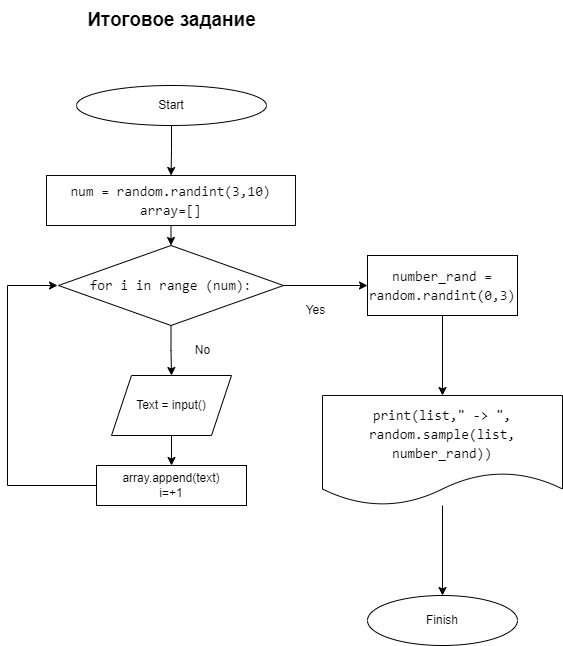

# Итоговая проверка (Задача)
Задача: 
Написать программу, которая из имеющегося массива строк формирует массив из строк, 
длина которых меньше либо равна 3 символам. Первоначальный массив можно ввести с клавиатуры, 
либо задать на старте выполнения алгоритма. При решении не рекомендуется пользоваться коллекциями, 
лучше обойтись исключительно массивами.

### Для решения задачи созданны 3 функции. Сам код находиться в папке C#

1.  Первая. Создает строковый массив String[] InitArray(int num) которое принимает случайное число для длинны массива
    * Указываем какая будет длинна массива
    * создаем цикл for  в котором пользователь с клавиатуря будет добовляться с каждым циклом по строке в элемент массива. Может вводить любые символы.

2. Вторая. void PrintArray(string[] array) Выводит созданный массив InitArray(num)

3. Треть. SimvolArray Перебор элементов в массиве и проверка какое количество элементов в массиве удовлетворяющее условию задачи

4. Четвертая. void FinalArray(string[] array) из созданного массива строк InitArray будет перебераться элементы массива, и  будет выводиться новый массив из строк, длина которых меньше либо равна 3 символам. 

* Дополнение
```sh
Созданный массив FinalArray будет выводить функция PrintArray
```


## Конец


## Блок схема решение донной задачи




