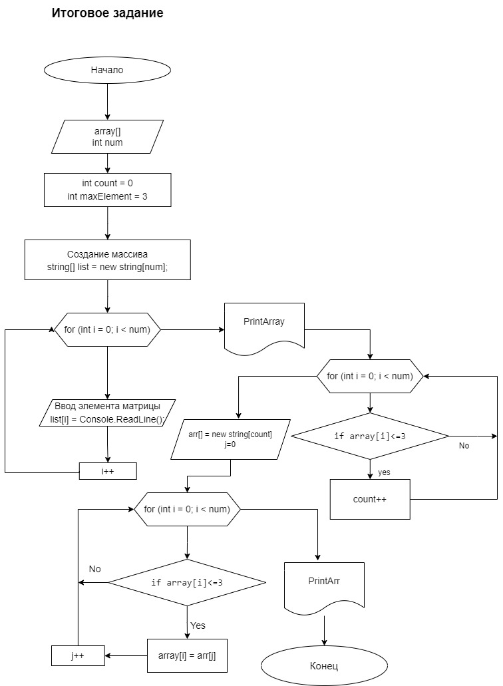

# Итоговая проверка (Задача)
Написать программу который из имеюшего массива строк формирует массив строк, длина которых меньше либо равна 3 символа.

### Для решения задачи созданны 3 функции. Сам код находиться в папке C#

1.  Первая. Создает строковый массив String[] InitArray(int num) которое принимает случайное число для длинны массива
    * Длинна массива будет определяться рандомно от 3 до 10
    * создаем цикл for  в котором пользователь с клавиатуря будет добовляться с каждым циклом по строке в элемент массива. Может вводить любые символы.

2. Вторая. void PrintArray(string[] array) Выводит созданный массив InitArray(num)

3. Треть. void FinalArray(string[] array) из созданного массива строк InitArray будет перебераться элементы массива выборочно, и  будет выводиться новый массив строк длина которого будет от 0 до 3
    * из созданного массива строк InitArray будет выбыраться элементы массива рандомно, и будет выводиться новый массив длина которого не будет превышать трех элементов.
## Конец


## Блок схема решение донной задачи




* Дополнение
```sh
Также решил следать эту задачу на питоне
```